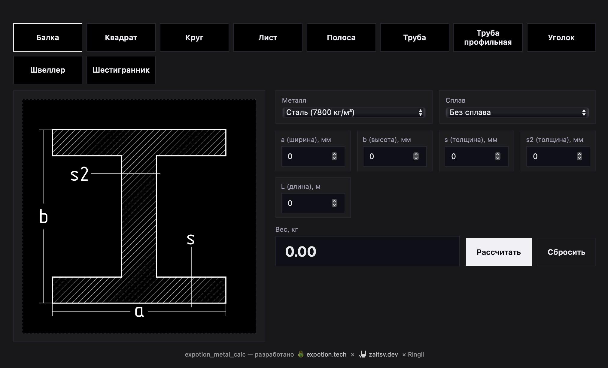

# expotion-metal-calculator

[](https://www.npmjs.com/package/expotion-metal-calculator)
[](https://www.npmjs.com/package/expotion-metal-calculator)
[](https://github.com/izumitellur/expotion-metal-calculator/blob/main/LICENCE)

Калькулятор массы металлопроката на React/Next.js с встроенными данными (металлы, сплавы, профили, плотности). Все SVG-иконки вшиты в компонент — работает из коробки.

<p align="center">
  
</p>

## Установка

```bash
npm install expotion-metal-calculator
```

## Использование

```tsx
import { MetalCalculator } from "expotion-metal-calculator";
import "expotion-metal-calculator/styles.css";

export default function Page() {
  return <MetalCalculator />;
}
```

## Описание

- **Что это:** UI-компонент для расчёта теоретического веса металлопроката (балка, труба, лист и т.д.) с моментальным перерасчётом
- **Профили:** двутавр, квадрат, круг, лист, полоса, труба круглая/профильная, уголок, швеллер, шестигранник
- **Данные:** встроенные русские наименования металлов/сплавов и их плотности
- **SVG:** все чертежи вшиты в компонент, ничего копировать не нужно

## Экспорты

```tsx
// Компонент
import { MetalCalculator } from "expotion-metal-calculator";

// Функция расчёта
import { calculateWeight, defaultInput } from "expotion-metal-calculator";

// Данные
import { metalAlloys, metals, metalShapes } from "expotion-metal-calculator";

// Типы
import type { CalculatorInput, CalculatorResult, ShapeId } from "expotion-metal-calculator";

// Стили
import "expotion-metal-calculator/styles.css";
```

## Ссылки

- **npm:** [npmjs.com/package/expotion-metal-calculator](https://www.npmjs.com/package/expotion-metal-calculator)
- **GitHub:** [github.com/izumitellur/expotion-metal-calculator](https://github.com/izumitellur/expotion-metal-calculator)

## Лицензия

MIT © 2022 Ringil (оригинальный Django-пакет) · © 2025 [expotion.tech](https://expotion.tech) · [zaitsv.dev](https://zaitsv.dev)
